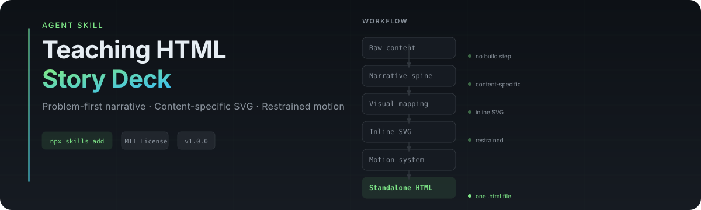

<p align="center">
  
</p>

---

## What it creates

A teaching HTML page that tells a story rather than listing slides.

| Type | Delivery |
|------|----------|
| Interactive teaching deck | Screen-recorded lesson, Bilibili horizontal page |
| Product / methodology explainer | Reveal the product only after the audience understands the problem |
| Architecture walkthrough | Data flow, permission graphs, decision boundaries |
| Vertical explainer | Douyin-style compact vertical presentation |
| Course lesson | Step-by-step curriculum with SVG illustrations |
| Deck upgrade | Improve an existing HTML presentation with better hierarchy and motion |

## Installation

### Claude Code

```bash
npx skills add lora-sys/teaching-html-story-deck
```

Then use `/teaching-html-story-deck` or invoke by name.

### Manual

```bash
mkdir -p ~/.claude/skills
cp -R teaching-html-story-deck ~/.claude/skills/
```

### OpenCode / Cursor

```bash
mkdir -p ~/.agents/skills
cp -R teaching-html-story-deck ~/.agents/skills/
```

Invoke with `$teaching-html-story-deck`.

## Quick start

```text
把这篇系统设计文章变成一份可全屏讲解的单文件 HTML。
需要问题、原理、数据流、架构、实战和最后总结。
```

```text
优化这个已有 HTML。保留内容，但改成黑白克制、
现代开发者产品感的高级动效版本，并增加真正服务理解的 SVG。
```

```text
把我的开源 Agent Skill 做成一个故事型演示：
先讲为什么开发者会过早开工，最后一页再揭示 Skill。
```

## How it works

```text
Raw content
    → Teaching objective
    → Narrative spine (problem → why → method)
    → Visual mapping (11 diagram types)
    → Content-specific inline SVG
    → Restrained motion system
    → Single-file HTML output
    → Validation
```

The skill chooses diagrams from the content. It does not paste a fixed architecture image into every deck.

## What's inside

| File | Purpose |
|------|---------|
| `SKILL.md` | Core workflow, rules, and output contract |
| `references/story-and-visual-framework.md` | Narrative spine and diagram selection |
| `references/svg-and-motion-system.md` | SVG patterns and motion layers |
| `references/user-preferences.md` | Persistent design and teaching preferences |
| `references/design-rationale.md` | Lessons from the Shape Up deck process |
| `references/quality-gates.md` | Final review checklist |
| `scripts/validate_deck.py` | Standalone HTML validator |
| `scripts/static_check.py` | Skill structure and eval validator |
| `scripts/init_deck.py` | Scaffold a new deck from template |
| `examples/` | Complete worked Shape Up deck (10 slides, 7 SVGs) |
| `evals/` | 5 evaluation cases + 7-category scoring rubric |

## Validate

```bash
python scripts/static_check.py              # Skill structure + evals
python scripts/validate_deck.py examples/shapeup-skill-linear-vercel-deck.html  # Bundled example
```

Expected output:

```text
PASS skill structure
PASS references
PASS eval JSON
PASS doctype
PASS title
PASS viewport
PASS slides
PASS script
PASS keyboard
PASS fullscreen
PASS reduced_motion
PASS no_external_scripts
PASS no_external_styles
PASS svg_accessibility
slides=10  svgs=7  accessible_svgs=7
```

## Design philosophy

> The deck succeeds when the audience can explain the topic after seeing it—not merely when the page looks impressive.

1. **Narrative before decoration.** Decide what the audience must understand before choosing visuals.
2. **Show relationships.** Turn sequence, dependency, authority, and transformation into diagrams.
3. **Generate visuals from the content.** Do not reuse the same diagram blindly.
4. **Motion explains state.** Animation reveals hierarchy, direction, or state change.
5. **One file, no build step.** Inline CSS, JavaScript, and SVG. No CDNs.
6. **High finish, restrained design.** Near-black surfaces, fine borders, sparse accent.
7. **No invented evidence.** Never fabricate metrics, benchmarks, or research results.
8. **Label conceptual models.** A proposed mental model is not measured data.
9. **Work without animation.** Respect `prefers-reduced-motion`.
10. **Do not imitate brands.** Borrow precision and restraint; never copy proprietary layouts.

## Supported agents

- **Claude Code** — `/teaching-html-story-deck`
- **Cursor / Windsurf** — `$teaching-html-story-deck`
- **OpenCode** — `$teaching-html-story-deck`
- **Codex CLI** — add command to `.codex/config.json`
- **Any custom text agent** with file-system access

## License

MIT © 2026 [lora-sys](https://github.com/lora-sys)

See [LICENSE](./LICENSE).

---

<div align="center">

**Problem → Why → Method → Data flow → Architecture → Example → Reveal**

[⭐ Star](https://github.com/lora-sys/teaching-html-story-deck) · [🐛 Issues](https://github.com/lora-sys/teaching-html-story-deck/issues) · [📖 Changelog](./CHANGELOG.md)

</div>
